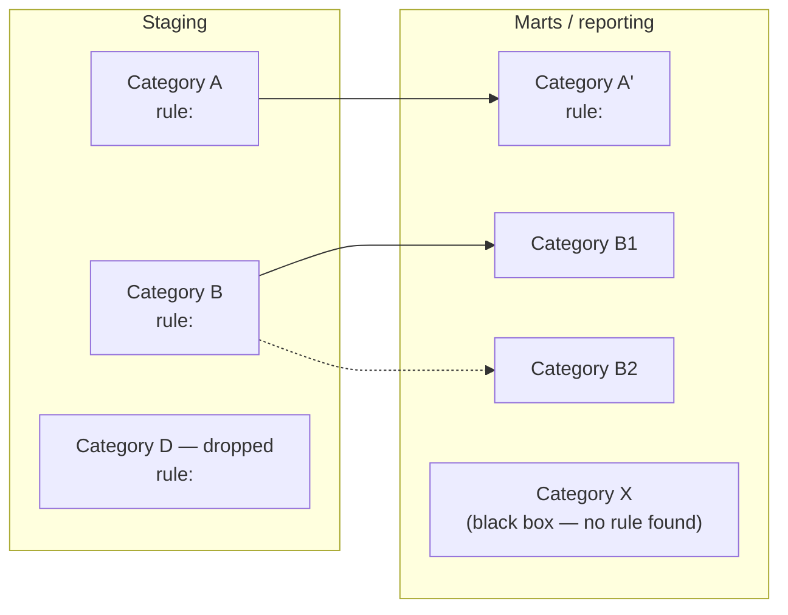

# Taxonomy view — provenance convention

One of several view conventions in `references/views/` (see also
[`erd-view.md`](./erd-view.md)). Where the ERD view answers "what runs before what," this
view answers a different question: **how do rows get classified by business meaning, and
does that classification hold as they move through the pipeline's stages?** Rendering it
is delegated to the `visualize-taxonomy` subagent (see
`.claude/agents/visualize-taxonomy.md`); SKILL.md step 7 decides which view(s) a run needs
and dispatches to the matching agent(s), rather than rendering inline.

## Why this exists

A dbt project (or any layered transformation pipeline) is often not really being asked
"what depends on what" — it's being asked "how do these models group by business meaning,
and where does that grouping actually come from in the code." An ERD answers the first
question well and the second one poorly: a dependency edge says nothing about *why* a row
ends up counted in one metric bucket versus another. Without a dedicated convention for
this, the categorization gets improvised fresh each time someone asks for it, with no consistent
way to mark "this category is a real, parseable rule" versus "this is inferred from
reading a model's logic by hand" — the same overconfidence risk `erd-view.md` addresses
for dependency edges, applied instead to business categories.

## Scope

Applies to any pipeline where **fact rows get sorted into business-meaningful groups** by
some combination of dimension values, timestamp windows, join conditions, or flags — most
commonly a dbt project's staging → intermediate → mart (reporting) layers, but the same
shape applies to any multi-stage transformation pipeline with a similar isolation logic.
Not every pipeline has this shape — a pipeline with no categorical logic in it at all (a
straight 1:1 passthrough) has nothing for this view to draw; use `erd-view.md` instead.

## Framing the output — what to emphasize

The point of this view is to illustrate real business scenarios applied to fact data, not
just draw a lineage graph with different node labels. Keep the actual analytical question
in view while building it: **based on the metrics and reporting a project produces, what
are the isolations, taxonomy, and hierarchy logic — applied via timestamps, dimensions, or
both — that determine whether a given fact row ends up included in a final metric?** This
goes beyond the physical star-schema structure (facts joined to dimensions) — the real
target is the *business* taxonomy and categories that the transformation code and any
metric/semantic-layer calculations are trying to express, which table and column names
alone won't tell you.

Frame every category around a concrete scenario a stakeholder would recognize — "orders
settled same-day," "corrections arriving late," "excluded test accounts" — not an
abstract "category A/B/C." That's what makes a category checkable against the business,
not just against the code. The end goal is to help the reader understand how each
scenario/group of rows transforms in terms of taxonomy as it moves across the pipeline's
stages — exactly what the stage-transition edges below exist to show, so don't skip
straight to hierarchy edges within one stage and call it done.

## The convention

**Nodes — a category, not a table:**
A node is a named business category: a group of rows sharing a business meaning (e.g.
"same-day settled records," "late-arriving corrections," "excluded — test/internal
accounts"), defined by an **isolation rule** — the actual predicate that decides
membership (a `WHERE`/`CASE WHEN` clause, a join condition, a dimension flag, a timestamp
window). Label each node with a short summary of its isolation rule, not just its name —
the rule is the checkable part.

- **Named, confirmed category** — the isolation rule was actually found and read (in a
  compiled dbt model's SQL, a metric/semantic-layer definition, or equivalent declared
  config).
- **Black-box category** — a business term used in docs, model/column naming, or
  stakeholder language, with no discoverable rule in the code available to this run (the
  taxonomy-view equivalent of `erd-view.md`'s black-box node). Draw it explicitly, labeled
  with why it's a black box (no access to the defining system, logic lives in a BI tool's
  own calculated field with no export on hand, etc.) — never drop it silently.
- **Dropped category** — a category whose rows are filtered out entirely before the next
  stage, rather than mapped forward into some downstream category (e.g. a `WHERE`
  excluding test/internal accounts before the marts layer's `CASE WHEN` ever runs). Draw
  the node with no outgoing stage-transition edge, and label it explicitly as dropped
  (name + rule + which downstream stage/file the filter lives in) — don't just omit the
  edge and let a reader guess whether that's a missing finding or an intentional exclusion.

**Stages:**
Represent each layer of the pipeline the categorization is evaluated at as a Mermaid
`subgraph` (e.g. staging / intermediate / marts, or whatever layering convention the
target project actually uses — don't assume dbt's specific names if the project uses
different ones). Category nodes live inside the stage they're evaluated at.

**Edges — two kinds, same solid/dashed provenance split as `erd-view.md`:**
- **Hierarchy edge** (parent category → child category, within a stage) — solid when a
  literal nested predicate is found in the code (a `CASE WHEN` nested inside another, a
  dimension table's own parent/child column); dashed when the parent/child relationship
  was concluded by reading logic, tests, or docs by hand rather than from one directly
  comparable predicate.
- **Stage-transition edge** (a category in stage N → the category/categories rows from it
  map to in stage N+1) — solid when the same isolation predicate (or a directly traceable
  rename/passthrough of it) is visible in both stages' compiled SQL; dashed when the
  mapping was inferred (the predicate changes shape between stages, or isn't visible in
  one of them, but the mapping is still concluded from reading both sides). A category can
  split into more than one downstream category, or several upstream categories can merge
  into one — draw fan-out/fan-in explicitly rather than picking a single edge to simplify.

**Provenance banner:**
Every taxonomy view opens with a one-line count, in the same shape as `erd-view.md`'s:

```
Provenance: 4 categories mechanically derived (parsed predicate) · 3 categories inferred
(direct code/doc reading) · 5 stage-transitions mechanically traced · 2 stage-transitions
inferred · 1 black-box category (no discoverable rule) · 1 category dropped (filtered out
before next stage)
```

Omit the "dropped" count from the banner only when there are none — don't pad it in at
zero every time, but never let a real one go uncounted the way an omitted outgoing edge
would otherwise silently suggest.

A near-zero mechanical count means the same thing it means for the ERD view: the
categorization logic wasn't cleanly extractable from what this run had access to, not that
nothing was found.

## Format

A Mermaid `flowchart` with one `subgraph` per pipeline stage, category nodes inside each,
hierarchy edges within a stage and stage-transition edges crossing between them. Skeleton:



(`s_drop` has no outgoing edge, per the dropped-category convention above — it stays in
the diagram so its absence downstream reads as confirmed, not missed.)

**Escaping real predicates in node labels:** a real isolation rule routinely contains
`<`, `<=`, `>`, `>=` — Mermaid parses a bare `<`/`>` inside a quoted label as markup, which
breaks the diagram. Escape them as HTML entities before writing the label:
`&lt;`, `&lt;=`, `&gt;`, `&gt;=`. For example, a rule written in code as
`datediff('day', order_date, settled_date) <= 0` becomes:

```
s_same["same_day_settled<br/>rule: datediff('day', order_date, settled_date) &lt;= 0"]
```

Embedded directly in the report (a ` ```mermaid ` fence) — plain text, renders natively
wherever the report is viewed, no extra tooling needed.

## What this is not

Same as `erd-view.md`: a documentation convention, not a rendering pipeline. Nothing in
`scan.py` extracts isolation predicates or categories today — every node and edge here is
manual judgment (reading compiled SQL, metric definitions, tests, docs), same as the rest
of this skill's judgment layer. If a target's categorization logic turns out to be
mechanically extractable in a reusable way (e.g. a common metric-YAML shape), that's a
candidate for a new `references/frameworks/` entry, following the same promotion path as
any other learning (see SKILL.md's "Capturing learnings" step) — not something this
convention doc tries to parse itself.

## When to reach for this instead of `erd-view.md`

Use this view when the real question is "how do rows/records get classified by business
meaning, and does that classification hold across stages" rather than "what runs before
what." A concrete trigger: someone asks to trace how business logic or metric definitions
are implemented across a set of models, specifically wanting to see the categories/facts
scenarios involved and how they transform stage to stage — not an execution-order
question at all, even though it's still a `gather-context` request. When it's ambiguous
which view fits, ask rather than default silently to the ERD one.
